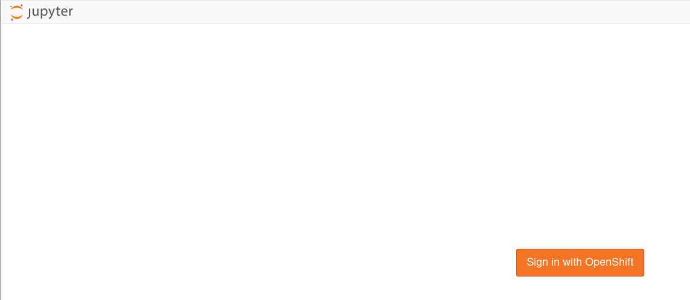
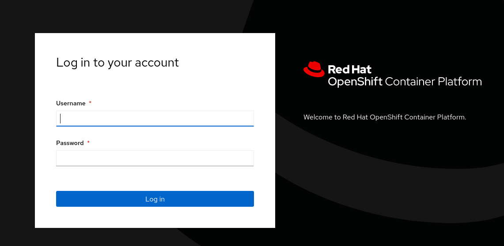
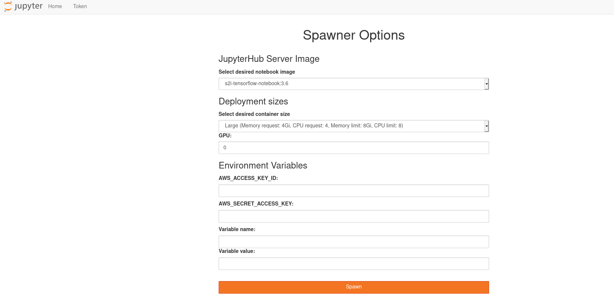
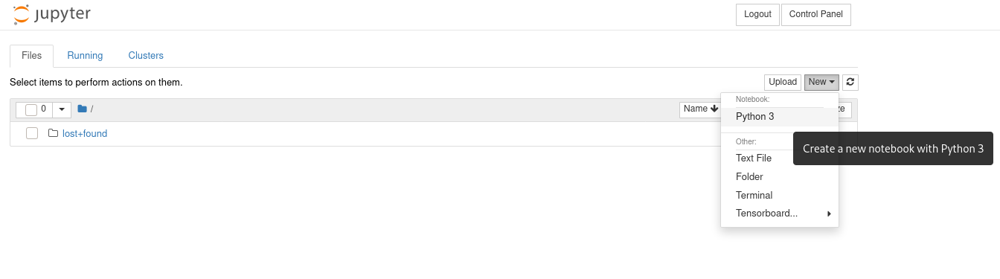
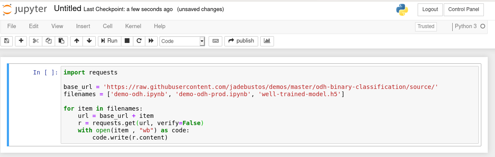
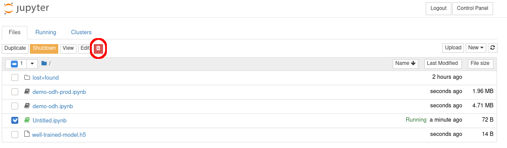
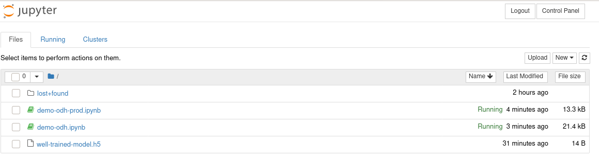
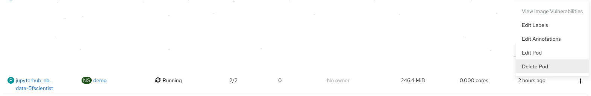

# Deployment

To deploy you will need:

+ A OpenShift cluster with OCS enabled.
+ A bastion host with OpenShift client installed.
+ A OpenShift cluster admin user.
+ A bastion user with public key configured.

## Configuration

Configure the folowing files to fit your environment:

+ **inventory** configure the bastion host ip and the ansible user.
+ **group_vars/general.yaml**

## OCS deployment

Create the OCS namespace:

```
ansible-playbook -i inventory deploy-ocs.yaml
```

Deploy OCS as usual.

> Not yet automated.

## Configure authentication

First you have con create two users. Check if HTPasswd provider is already created in your deployment. 

If it is created then you can create the two user as shown:

If HTPasswd provider is already configured you will need to add two users:

+ **data_scientist** user with password **temporal2020**.
+ **production** user with password **temporal2020**.

```
[user@bastion ocp]$ oc get identities
NAME                            IDP NAME            IDP USER NAME   USER NAME     USER UID
htpasswd_provider:opentlc-mgr   htpasswd_provider   opentlc-mgr     opentlc-mgr   db6d9da9-99fb-459b-a6da-2cc900722896
[user@bastion ocp]$ oc get secrets -n openshift-config | grep htt
[user@bastion ocp]$ oc get secrets -n openshift-config | grep ht
htpasswd-secret                       Opaque                                1      133m
[user@bastion ocp]$ oc describe secrets htpasswd-secret -n openshift-config
Name:         htpasswd-secret
Namespace:    openshift-config
Labels:       <none>
Annotations:  <none>

Type:  Opaque

Data
====
htpasswd:  9229 bytes
[user@bastion ocp]$ oc get secret htpasswd-secret -ojsonpath={.data.htpasswd} -n openshift-config | base64 -d > users.htpasswd
[user@bastion ocp]$ htpasswd -bB users.htpasswd data_scientist temporal2020
Adding password for user data_scientist
[user@bastion ocp]$ htpasswd -bB users.htpasswd production temporal2020
Adding password for user production
[user@bastion ocp]$ oc create secret generic htpasswd-secret --from-file=htpasswd=users.htpasswd --dry-run -o yaml -n openshift-config | oc replace -f -
secret/htpasswd-secret replaced
[user@bastion ocp]$
```

If there is no HTPasswd provided you can create it:

```
[user@yourhost ansible]$ ansible-playbook -i inventory create-idp.yaml
```

## Install Opendatahub operator

Using the GUI or CLI install the opendatahub operator as cluster admin.

> Not yet automated.

## Create project to work on

Create a project for **data_scientist** user to work on:

```
[user@yourhost ansible]$ ansible-playbook -i inventory create-lab.yaml
```

This will create the **binary-classification** project for **data_scientist** user and will assign project admin role to that user.

After that you will have to deploy, default configuration, opendatahub in that project.

When all is deployed you will have to increase the limits to be able to create jupyter notebooks with medium and large resource configuration:

```
[user@bastion ocp]$ oc whoami
opentlc-mgr
[user@bastion ocp]$ oc project
Using project "binary-classification" on server "https://api.cluster-syone-a5ce.syone-a5ce.example.opentlc.com:6443".
[user@bastion ocp]$ oc get limits
NAME                                         CREATED AT
binary-classification-core-resource-limits   2020-06-22T08:23:22Z
[user@bastion ocp]$ oc describe limits binary-classification-core-resource-limits
Name:       binary-classification-core-resource-limits
Namespace:  binary-classification
Type        Resource  Min  Max   Default Request  Default Limit  Max Limit/Request Ratio
----        --------  ---  ---   ---------------  -------------  -----------------------
Container   memory    -    6Gi   256Mi            1536Mi         -
Container   cpu       -    4     50m              500m           -
Pod         cpu       -    4     -                -              -
Pod         memory    -    12Gi  -                -              -
[user@bastion ocp]$ 
```

You can use **oc edit limits binary-classification-core-resource-limits** and you can configure something like that:

```
# Please edit the object below. Lines beginning with a '#' will be ignored,
# and an empty file will abort the edit. If an error occurs while saving this file will be
# reopened with the relevant failures.
#
apiVersion: v1
kind: LimitRange
metadata:
  creationTimestamp: "2020-06-22T08:23:22Z"
  name: binary-classification-core-resource-limits
  namespace: binary-classification
  resourceVersion: "1658716"
  selfLink: /api/v1/namespaces/binary-classification/limitranges/binary-classification-core-resource-limits
  uid: 85cdc5df-e6c7-4e10-affd-98b1356210f4
spec:
  limits:
  - default:
      cpu: 500m
      memory: 1536Mi
    defaultRequest:
      cpu: 50m
      memory: 256Mi
    max:
      cpu: "8"
      memory: 24Gi
    type: Container
  - max:
      cpu: "16"
      memory: 48Gi
    type: Pod
```

After configuration:

```
[user@bastion ocp]$ oc describe limits binary-classification-core-resource-limits
Name:       binary-classification-core-resource-limits
Namespace:  binary-classification
Type        Resource  Min  Max   Default Request  Default Limit  Max Limit/Request Ratio
----        --------  ---  ---   ---------------  -------------  -----------------------
Container   cpu       -    8     50m              500m           -
Container   memory    -    24Gi  256Mi            1536Mi         -
Pod         memory    -    48Gi  -                -              -
Pod         cpu       -    16    -               
[user@bastion ocp]$
```

## Create S3 buckets

Now we need to create the following buckets:

* **train-cat** we will upload the cat images to train the model.
* **train-dog** we will upload de dog images to train the model.
* **validation-cat** we will upload the cat images to validate the model during training.
* **validation-dog** we will upload the dog images to validate the model during training.
* **test-cat** we will upload the cat images to test the model after training.
* **test-dog** we will upload the dog images to test the model after training.
* **models** we will upload the model to be consumed for more applications.

We need to install the **s3cmd** utility in some server. It could be the bastion host.

We need to get the data for the S3 API. As this is a demo, for the sake of the simplicity we will use the admin user. So to get the S3 credentials and endpoint:

```
[user@bastion ocp]$ noobaa status -n openshift-storage
...
#----------------#
#- S3 Addresses -#
#----------------#

ExternalDNS : [https://s3-openshift-storage.apps.cluster-xxxxx-yyyyy.example.whatever.com https://a8758f5fa739v43b9bb608984200b8d7-1883911118.eu-central-1.elb.amazonaws.com:443]
.....

#------------------#
#- S3 Credentials -#
#------------------#

AWS_ACCESS_KEY_ID     : XXXXXXXXXXXXXXXXXXXX
AWS_SECRET_ACCESS_KEY : YYYYYYYYYYYYYYYYYYYYYYYYYYYYYYYYYYYYYYYY

....
[user@bastion ocp]$
```

> You can install the NooBaa operator from [GitHub](https://github.com/noobaa/noobaa-operator#noobaa-operator).

You need to create the **s3cmd** configuration file:

```
[default]
access_key = XXXXXXXXXXXXXXXXXXXX
secret_key = YYYYYYYYYYYYYYYYYYYYYYYYYYYYYYYYYYYYYYYY
host_base = s3-openshift-storage.apps.cluster-xxxxx-yyyyy.example.whatever.com:443
host_bucket = s3-openshift-storage.apps.cluster-xxxxx-yyyyy.example.whatever.com:443
use_https = True
check_ssl_certificate = False
check_ssl_hostname = False
```

So to create the buckets:

```
[user@bastion ocp]$ s3cmd -c s3cfg.cfg mb s3://train-cat
[user@bastion ocp]$ s3cmd -c s3cfg.cfg mb s3://train-dog
[user@bastion ocp]$ s3cmd -c s3cfg.cfg mb s3://validation-cat
[user@bastion ocp]$ s3cmd -c s3cfg.cfg mb s3://validation-dog
[user@bastion ocp]$ s3cmd -c s3cfg.cfg mb s3://test-cat
[user@bastion ocp]$ s3cmd -c s3cfg.cfg mb s3://test-dog
[user@bastion ocp]$ s3cmd -c s3cfg.cfg mb s3://models
[user@bastion ocp]$ s3cmd -c s3cfg.cfg ls
2020-06-23 17:59  s3://models
2020-06-23 17:59  s3://test-cat
2020-06-23 17:59  s3://test-dog
2020-06-23 17:59  s3://train-cat
2020-06-23 17:59  s3://train-dog
2020-06-23 17:59  s3://validation-cat
2020-06-23 17:59  s3://validation-dog
[user@bastion ocp]$ 
```

> You can create them using a script in the next section.

## Upload data to S3

No we need to upload data to S3.

You can use the [upload-data.sh](../source/data/upload-data.sh) script to create the buckets and upload the data to the buckets.

> Remember to configure the [s3cfg.cfg](../source/data/s3cfg.cfg) according to your deployment.

 ## Create kafka topic

 We need to create a kafka topic to send images to be predicted using the model:

 ```
 [user@yourhost ansible]$ ansible-playbook -i inventory create-topic.yaml
 ```

 ## Create Opendatahub instance

 Log into the project you have just created and create an Opendatahub instance. Once the instance is completely deployed:
 
 + Go to **Network -> Routes** and launch the **jupyterhub**:

 

+ Login using OpenShift credentials (**data_scientist** user):

 

+ Spawn a notebook:



+ Create a notebook:



+ Download the two notebooks and the weights for the well trained model. You can download it running the following python code:



```
import requests

base_url = 'https://raw.githubusercontent.com/jadebustos/demos/master/odh-binary-classification/source/'
filenames = ['demo-odh.ipynb', 'demo-odh-prod.ipynb', 'well-trained-model.h5']

for item in filenames:
    url = base_url + item
    r = requests.get(url, verify=False)
    with open(item , "wb") as code:
        code.write(r.content)
```

+ You can remove the notebook. If you go to the **home tab**:



+ Run the **demo-odh.ipynb** and **demo-odh-prod.ipynb** notebooks, look for the following:

```
# <<< YOUR WHATEVER HERE>>>
```

and change to fit your environment. You will have to change the S3 and kafka endpoints and S3 credentials as well. Do not forget to save your modifications.

Now you have deployed all the pieces you need for the demo.

You should follow the [demo script](https://github.com/jadebustos/demos/blob/master/odh-binary-classification/doc/for-presenters.md) just to check that all is working properly. Fix the problems and when all works well you should delete all the files and directories that were created in the demo. After deletion:



Perform a **logout**.

Now you should go to **Workloads -> Pods** and delete the following pod:



This pod is created when you spawn a notebook the first time you connect. So when you connect again you will have to spawn a new notebook and as persistent volumes are being used the notebooks you have just downloaded will be available.


