# for presenters

## Deploy Open Data Hub

You will show the audience how easy is to deploy **Open Data Hub**.

Log as **production** user:

+ Create a project.

+ Go to **Operators -> Installed Operators**. The **Open Data Hub Operator** will appear in a few seconds:

+ Deploy OpenDataHub in that proyect. Click on **Open Data Hub Operator** and scroll down to show what projects and versions includes the Open Data Hub. After that click in **Create Instance**:

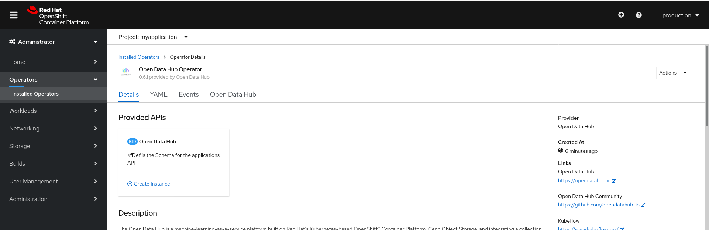

+ Scroll down the yaml file showing it. Do not modify anything we will use the default configuration:

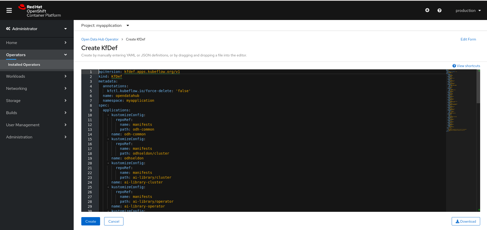

+ Click on **Create** to start deploying **Open Data Hub** on the project.

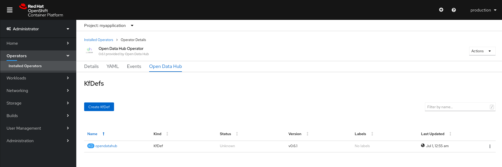

+ Go to **Workloads -> Pods** to show how pods are being deployed:

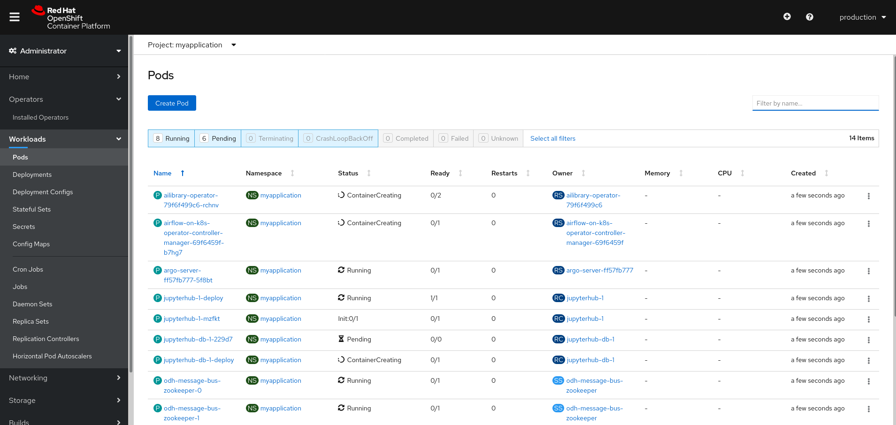

Deployment could take from 2 to 5 minutes. 

## Show the audience how easy is to access the deployed software

Close the session and log with the **data_scientist** user.

Go to **binary-classification** project and go to **Networking -> Routes** to show the routes to access all the deployed software.

Browse the following to show how easy is to deploy and use them:

+ **Argo**:

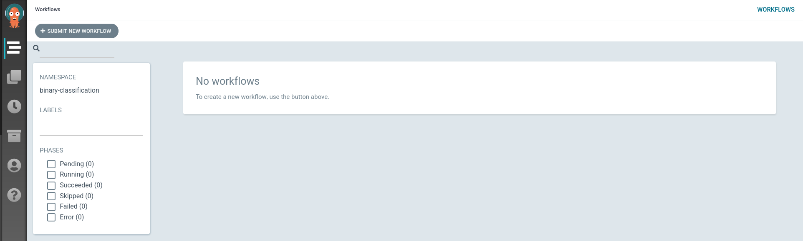

+ **Grafana**:

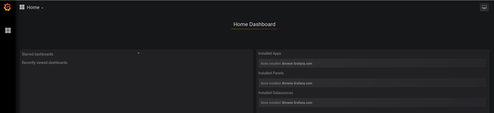

+ **Prometheus**:

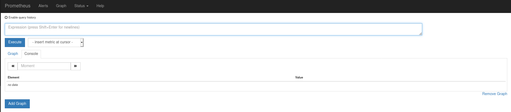

+ **Apache Superset** (log with credentials **admin/admin**):

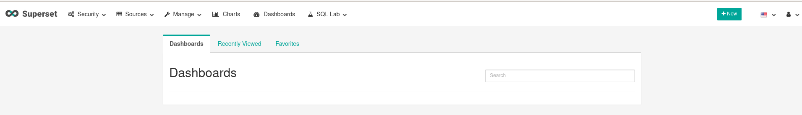

## Jupyter Notebook Demo

Go to jupyterhub route and log using the **data_scientist** user:

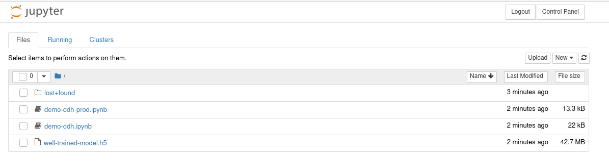

Click on **demo-odh.ipynb** to launch the notebook:

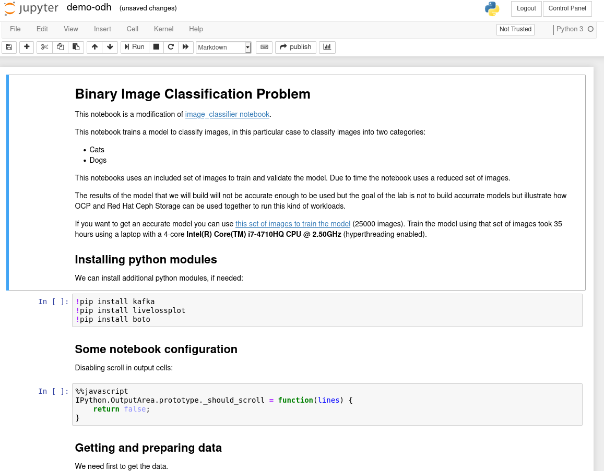

This notebook trains a Convolutional Neural Network to solve a binary classification problem. Classifies images as cat or dog.

+ **Installing python modules** show how to install python modules if necessary.

+ **Some notebook configuration** disables scrolling in output cells.

+ **Getting and preparing data** first cell will create some directories in the notebook filesystem. Browse the **data** subdirectories to show that they are empty:

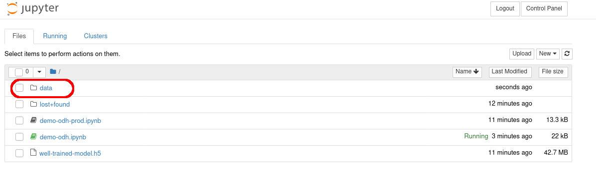

Second cell will download **training**, **validation** and **test** data from Red Hat Ceph Storage to the directories you have just created. So after executing the cell browse the **data** subsdirectories to show the data was downloaded from Red Hat Ceph Storage:

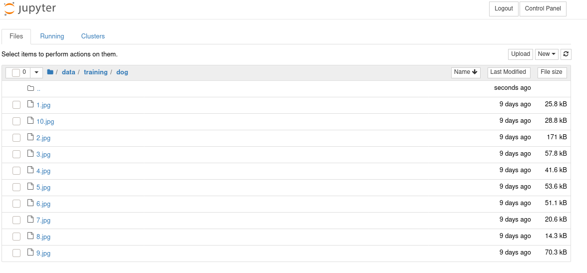

The third cell will define a class that implement the Convolutional Neural Network.

+ **Training the model** first cell will create the Convolutional Neural Network, train it and save the model. We will use few data so the model will not be very accurate:

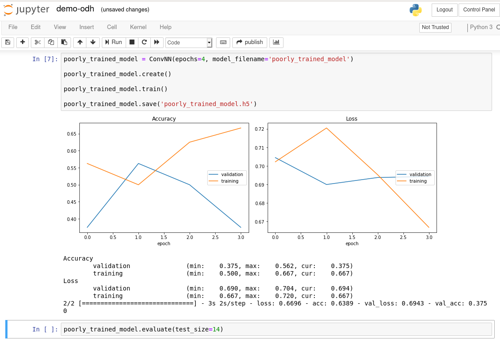

The second cell will evaluate the model we have just trained using the test dataset:

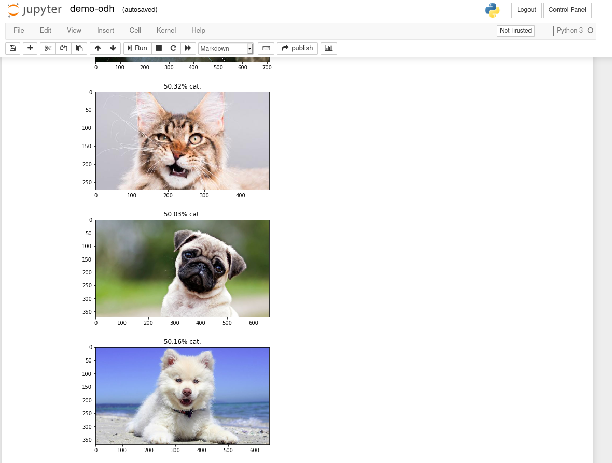

As expected the model is not a good model.

+ **Loading a well trained model** data scientist will keep improving the model until they have a good one. Instead of working hard to get a good model we will load a model which is well trained to simulate the workflow data scientist do. First cell will load a model which is well trained (it could be improved but it is good enough for us).

Second cell will evaluate this model using the same dataset that was used with the model we have just trained (the bad one):

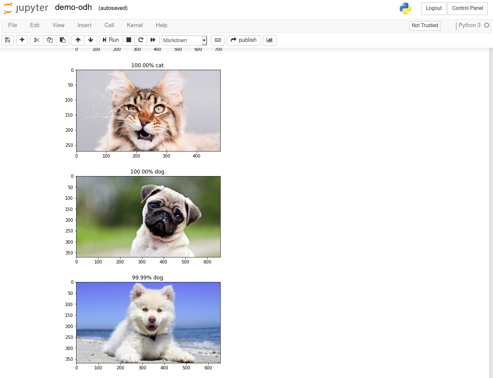

+ **Predict** Now that the model seems to work well you will need to evaluate it with more data. For that reason you will send new data to a kafka topic, these images will be downloaded to **data/predict** directory and the model will make predictions using them. Browse the directory to show that there is no data:

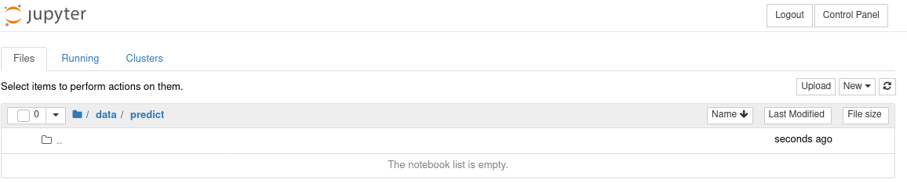

You can use the script [download-some-pictures.py](../source/download-some-pictures.py) to download some pictures and you can use the scritp [upload-pictures-to-kafka.sh](../source/upload-pictures-to-kafka.sh) to upload the data to kafka topic:

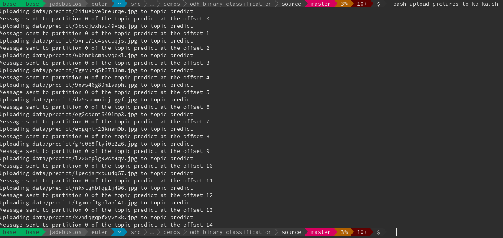

Now you can execute the cell to download the data from the kafka topic and make the predictions over the data. Browse the **data/predict** directory to show that data has been downloaded from kafka:

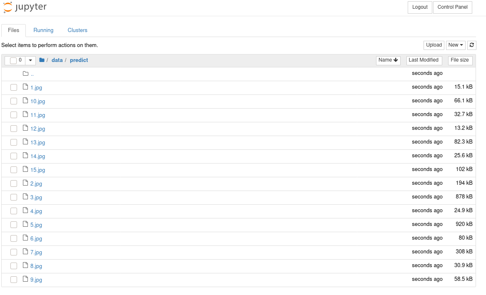

+ **Predicted Cats** executing this cell all the cats predicted using the model and the data sent to kafka will be shown:

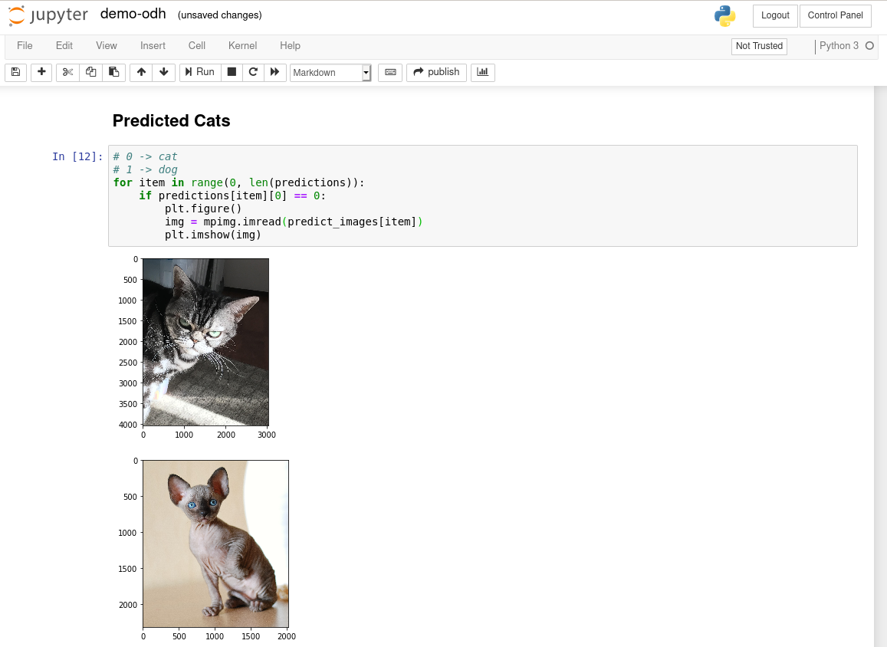

+ **Predicted Dogs** executing this cell all the dogs predicted using the model and the data sent to kafka will be shown:

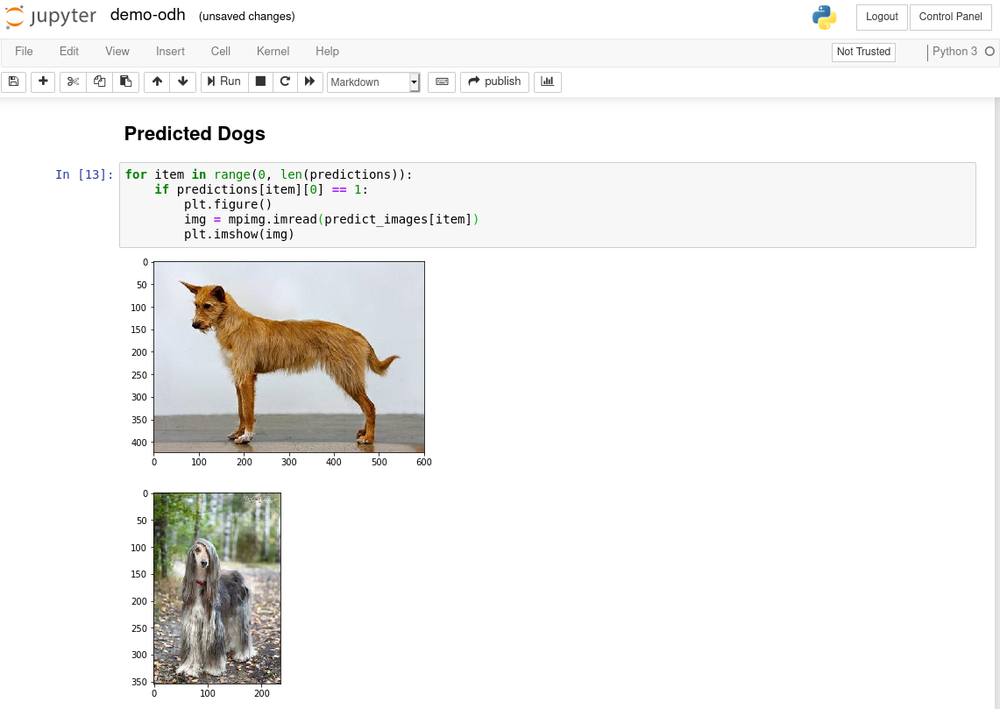

+ **Upload the model to Red Hat Ceph Storage** although the model does not predict well some cats/dogs (we have used some cats/dogs that are not very common as Portuguese Hound or Sphynx Cat) we can consider the model as good enough. So we will upload the model (model weights) to a bucket in Red Hat Ceph Storage. Executing this cell the model will be uploaded to a bucket to be used by other applications.